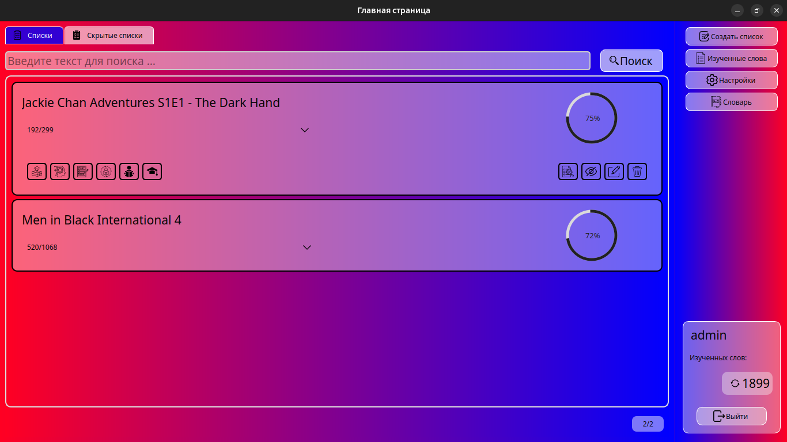
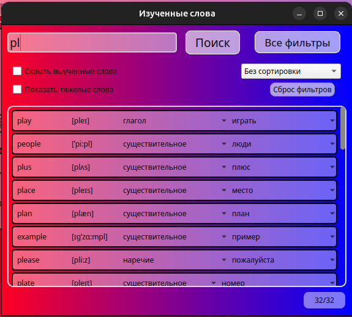
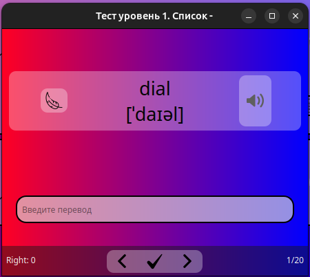

# 📘 Subtitle Vocabulary Trainer  
### *Инструмент для изучения английских слов на основе субтитров*

  
  
  
  
  

---

## ✨ Описание

**Subtitle Vocabulary Trainer** — это настольное приложение, которое анализирует субтитры, создаёт словари и помогает учить слова через продуманную систему тестов.  
Идеально подходит для изучения английского через фильмы и сериалы.

---

## 🌟 Основные возможности

### 🔍 Извлечение слов из субтитров
- Анализ текста с помощью **spaCy**
- Определение частей речи, удаление повторов и нормализация слов
- Создание словарных списков на основе субтитров или вставленного текста

### 📝 Модуль тестирования (5 режимов)

| № | Тип теста | Описание |
|---|-----------|----------|
| 1 | Запоминание | Просмотр слова → перевод |
| 2 | Выбор ответа | 4 варианта перевода |
| 3 | Ввод перевода | Полная проверка знания |
| 4 | Подсказка 50% | Ввод английского слова |
| 5 | Подсказка 25% | Усложнённое написание |

Каждый тест повышает уровень владения словом → влияет на прогресс списка.

### 📊 Прогресс изучения
- Круговой индикатор выученных слов в каждом списке  
- Оценка сложности субтитров  
- Быстрое понимание — подходит ли фильм для аудиопросмотра

### 🗂 Управление списками
- Просмотр, редактирование, удаление  
- Скрытие/архивация списков  
- Раздел «Изученные слова» (слова, которые больше не появляются в тестах)

---

## 🛠 Технологии

| Компонент | Использование |
|----------|---------------|
| **Python** | основной язык проекта |
| **PyQt5** | графический интерфейс |
| **SQLite** | локальная база данных |
| **SQLAlchemy** | ORM для работы с БД |
| **spaCy** | NLP-анализ субтитров |
| **python_bcrypt** | безопасное хеширование паролей |

---

## 📦 Установка

🖥 Windows‑сборка (EXE)

Готовая сборка для Windows доступна в разделе [Releases](https://github.com/yasperrus/LearnEnglishSubtitles/releases): [Windows Build 1.0.0](https://github.com/yasperrus/LearnEnglishSubtitles/releases)

---

## 📄 Релизы

Будущие релизы будут включать:

- [ ] **EXE для Windows**
- [ ] **DEB для Ubuntu**

---

## 📸 Скриншоты

### Главная страница

### Изученные слова

### Пример тестирования

---

## 🎯 Зачем нужно приложение?

- Учит **слова из реальных фильмов и сериалов**, а не искусственных списков.  
- Позволяет определить **сложность субтитров** и понять, насколько легко будет понимать речь.  
- Формирует *точный список слов, которые нужно выучить*.  
- Помогает расширять словарный запас через тесты с разной сложностью.  

---

## 🤝 Контрибьютинг

Pull Requests приветствуются.  
Если есть идеи по улучшению — создавайте Issue!

---

## 📜 Лицензия

Проект распространяется под лицензией **MIT**.
